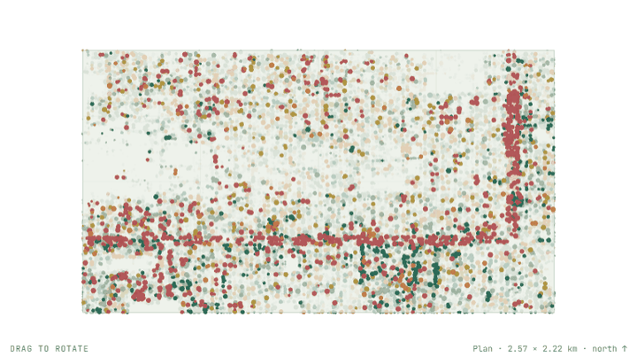

# spatial-fields

Three interactive spatial visualizations from [tomshanks.dev](https://tomshanks.dev), each built from data I collected or processed myself. Components are React client components lifted verbatim from the site (Next.js 14, React 18, CSS modules); the data packers are the Python scripts that produced the binaries. No dependencies beyond React; each one is raw WebGL.

Every visualization animates with page scroll first, then hands control to the visitor: drag to rotate, arrow keys when focused, double-click or `R` to reset. Reduced-motion and no-WebGL fallbacks are handled in each component.

| Folder | Live | Data | What it shows |
|---|---|---|---|
| [`adsb-field/`](adsb-field) | [/projects/adsb-aircraft-tracker](https://tomshanks.dev/projects/adsb-aircraft-tracker) | 60,000 ADS-B position reports received on a single RTL-SDR in Denver, packed to 472 KB of local metre offsets | Bearing and distance around the receiver at rest; scrolls into an altitude column; free rotation on drag. Measured range from the full snapshot: max 131.92 km, p95 53.94 km, median 15.95 km. |
| [`canopy-strata/`](canopy-strata) | [/projects/denver-urban-tree-classification](https://tomshanks.dev/projects/denver-urban-tree-classification) | 18,272 tree crowns segmented from USGS 3DEP LiDAR and classified from NAIP + Sentinel-2 features, 180 KB | Plan view colored by class and sized by canopy area; on scroll the neighborhood tilts and separates into LiDAR-measured height strata (0–6, 6–12, 12–18, 18+ m), each labeled with its real composition. |
| [`received-surface/`](received-surface) | [/](https://tomshanks.dev/) | The 640 px visible-band METEOR-M2 4 image received 2026-09-14 (60 KB), sampled on the GPU into 25,625 points | The homepage hero. Every point is a received pixel; at rest it floats as a particle surface that answers the pointer, and scrolling resolves it back into the source frame. Raw WebGL, no library. |

## What they do

| | | |
|:-:|:-:|:-:|
|  |  |  |
| `adsb-field` | `canopy-strata` | `received-surface` |

## Using a component

Each folder is self-contained: the `.tsx`, its `.module.css`, a `data/` directory, and the packer that built it. Serve `data/` as static files and point the component's fetch path at it (the site serves them from `/projects/...`; the paths are the only site-specific thing in the code).

```
npm i react react-dom
```

`received-surface/ParticleSurface.tsx` needs only React: it compiles its own shaders and samples the image into a point grid at mount.

## Data provenance

- **ADS-B**: 1090 MHz broadcasts → RTL-SDR → readsb → SBS log → PostgreSQL/PostGIS. The packer samples 60,000 of 159,814 position reports and writes bearing/distance/altitude as local offsets only; no receiver coordinates are included.
- **Canopy**: crowns by watershed segmentation on the canopy-height model; class predictions from the trained pipeline (69.0% accuracy on a random split, 66.4% with whole city blocks held out). Local metre offsets only.
- **Received surface**: SatDump MSU-MR visible composite from a 65° METEOR-M2 4 pass, 137.9 MHz LRPT, Raspberry Pi 3B + RTL-SDR Blog V4, Denver. Downscaled to 640 px; no other processing.

MIT. Tom Shanks, Denver.
