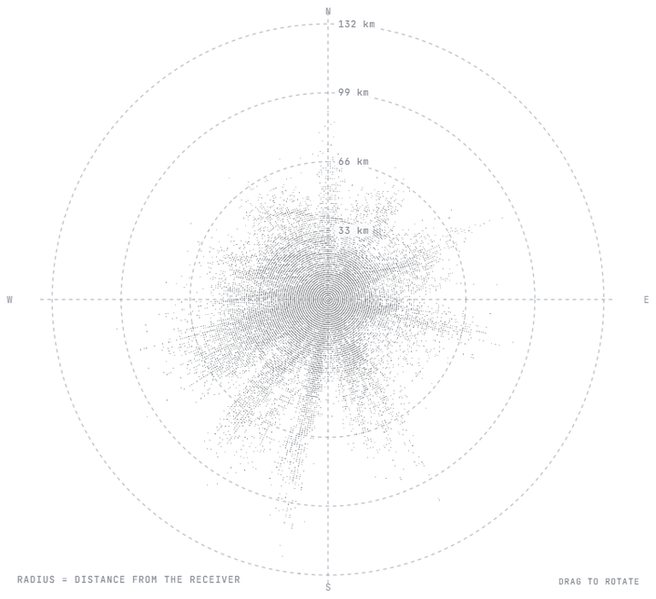

# adsb-field



60,000 aircraft position reports received on one RTL-SDR in Denver, drawn as a WebGL point field. At rest each point sits at its bearing and distance from the receiver (rings every 33 km out to 132 km). As the page scrolls the field re-plots into a column where height is altitude above sea level; drag to rotate it, arrow keys when focused, double-click or `R` to reset. Reduced-motion users get the same two states without the tween. No WebGL: a static image is shown instead.

Live: https://tomshanks.dev/projects/adsb-aircraft-tracker

## Files

| File | What |
|---|---|
| `AdsbField.tsx` | React client component, raw WebGL, no dependencies. `compact` prop drops the axis labels for small plates. |
| `adsb.module.css` | Layout, labels, dark mode. |
| `prepare-adsb-field.py` | Packer. Reads the tracker's receiver-relative `altitude_vs_range` export and writes the two data files. |
| `data/contacts.bin` | 60,000 × 8-byte little-endian records, 472 KB. |
| `data/contacts.json` | Field layout, counts, plot extents. |

## Record layout

```
bearing_deg   u16   0–359, from true north
range_10m     u16   distance from the receiver in 10 m units (max 132 km)
altitude_10ft u16   pressure altitude in 10 ft units
category      u8    operator class from the 520,000-aircraft reference index
pad           u8
```

Records are a uniform sample of 158,909 position reports in the documented snapshot. The full snapshot measured max range 131.92 km, p95 53.94 km, median 15.95 km. Only receiver-relative values are stored; the receiver location is not in the data or the code.

## Pipeline behind the data

1090 MHz → RTL-SDR → readsb → SBS log → rsync → Python ingest → PostgreSQL/PostGIS (materialized views for the heavy spatial queries) → FastAPI → React/Leaflet. This component reads a static export of that database, so it needs no backend.
