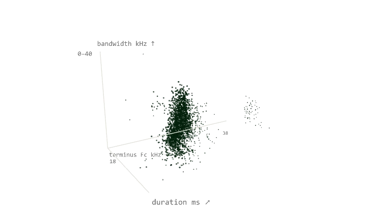
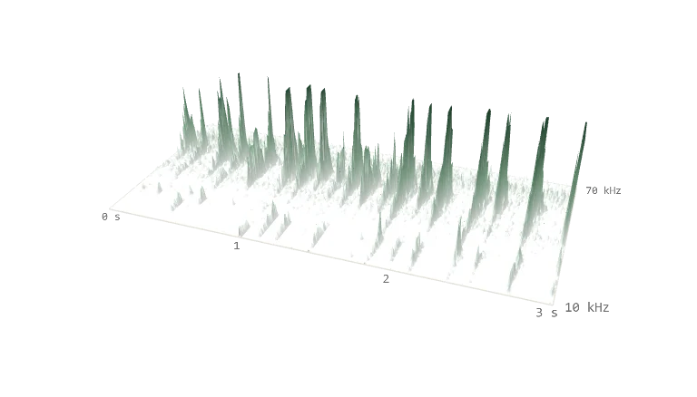
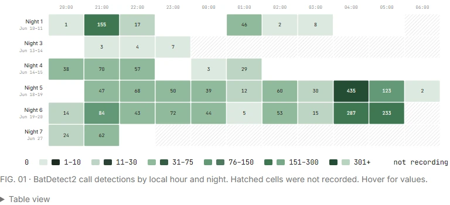

# Backyard bat survey fields

Three linked views from the [backyard bat survey](https://tomshanks.dev/projects/backyard-bat-survey): a call-shape field, a spectrogram relief, and an hourly activity heatmap. The source data came from an AudioMoth recorder operated in Denver during June 2026.

| Call shape | Sound relief | Activity by hour |
|:-:|:-:|:-:|
|  |  |  |

Live: https://tomshanks.dev/projects/backyard-bat-survey

## Files

| File | What |
|---|---|
| `CallField.tsx` | Interactive point field for time, frequency, bandwidth, duration, and confidence. |
| `SoundRelief.tsx` | Interactive spectrogram relief with synchronized slowed-audio playback. |
| `HourHeatmap.tsx` | Responsive SVG view of detections by hour and night, with an accessible table. |
| `field.ts` | Shared Three.js renderer, labels, scroll morph, drag, keyboard control, theme rebuild, and cleanup. |
| `bats.module.css` | Shared layout, controls, fallbacks, responsive rules, and dark mode. |
| `data/calls3d.json` | 2,228 compact call-measurement rows. |
| `data/relief_n5.json` | Quantized 360 by 120 spectrogram grid. |
| `data/heat.json` | Hourly aggregates used to check the heatmap values. |
| `data/clip-20260619-044047-te10.mp3` | One three-second source window stretched to one-tenth speed. |
| `data/field-*.webp` | Light and dark no-WebGL fallbacks. |

## What is included

### `CallField.tsx`

Plots 2,228 BatDetect2 call detections as points. The scroll state begins with time of night, terminal frequency, and recorded night. It then rearranges the same points by terminal frequency, bandwidth, and duration. Point size represents model confidence.

`data/calls3d.json` stores one compact row per detection:

```text
[night_index, time_offset_seconds, terminal_khz, upper_khz, duration_ms, confidence]
```

These are call detections, not counts of individual bats.

### `SoundRelief.tsx`

Renders one three-second clip as a 360 by 120 spectrogram grid. Relative spectral level drives the display height. Scroll flattens the relief back into a conventional spectrogram. The included MP3 is the same clip played at one-tenth speed.

`data/relief_n5.json` contains the grid dimensions and quantized values. The height is a display mapping. It is not terrain, distance, or a calibrated sound-pressure measurement.

### `HourHeatmap.tsx`

Shows BatDetect2 detections by local clock hour and recorded night. Hatched cells mark hours when the recorder was off. `data/heat.json` contains the same hourly aggregates used to check the inline figure values.

## Using the components

The components use React, Three.js, and a shared CSS module:

```bash
npm i react react-dom three
```

Copy `data/` into your public assets. The site version fetches files from `/projects/bat-survey/`; either preserve that public path or update the constants in `CallField.tsx` and `SoundRelief.tsx`.

`field.ts` owns the shared renderer, scroll morph, pointer and keyboard controls, theme rebuild, intersection observer, and cleanup. Both Three.js fields support drag, arrow keys, `R`, and double-click reset. The WebP images are light and dark no-WebGL fallbacks.

## Provenance and limits

- AudioMoth recorder at 250 kHz, mounted about two metres above ground in a Denver backyard. Exact location is not published.
- Seven nights were recorded between June 10 and June 27, 2026; six were analyzed.
- A high-energy detector selected the 180 loudest three-second windows from each analyzed night. BatDetect2 then identified and measured echolocation sweeps.
- Species evidence on the live page comes from Kaleidoscope Pro's North American classifier and manual review of the supporting clips. The exported point field contains BatDetect2 measurements, not species labels.
- Acoustic species identification remains probabilistic. Capture or DNA evidence would be needed for confirmation.
- The raw WAV archive remains offline. This folder contains derived measurements, one short slowed clip, and rendered fallbacks.

Code and included derived artifacts are released under the repository's MIT license.
