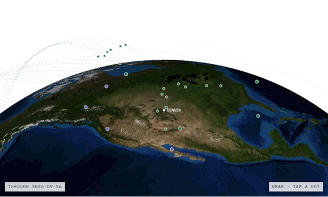

# orbit-globe



Every pass my RFPI ground station recorded between 14 September and 4 October 2026 that has enough saved data to place on a globe: 120 of the 255 archived passes. Each dashed line is the orbit predicted from the TLE the station saved for that pass, and each dot is the satellite's predicted position when the recording started (or, for weather passes that decoded, at the first image scan). The view is an isometric, orthographic camera on the WGS84 ellipsoid over a public Denver city reference point, with NASA Blue Marble imagery under it.

Scrolling replays the passes in order, the same way the other fields resolve on scroll. Play runs the three weeks in about 14 seconds, All shows every pass, and the timeline under the globe lets you scrub through it yourself. Drag to rotate, arrow keys when focused, double-click or `R` to reset, `]` and `[` to step through passes. Selecting a dot shows what the station received on that pass, and the 42 weather passes that produced images open their SatDump composite inside the frame. Reduced motion jumps Play straight to the end. The globe is 2D canvas, so it does not depend on WebGL.

Live: https://tomshanks.dev/projects/rfpi (hero) and https://tomshanks.dev/ (compact card)

## Files

| File | What |
|---|---|
| `OrbitGlobe.tsx` | React client component, no dependencies beyond React. Canvas 2D. `compact` prop drops the legend and shortens the caption for small cards. |
| `orbit-globe.module.css` | Toolbar, timeline, caption, imagery viewer, dark mode. |
| `prepare-orbit-globe.py` | Packer. Reads the station's archive review (catalog, saved orbit context, per-pass manifests) and writes the data files below. The archive itself is private and not included. |
| `data/orbit-globe.json` | 120 passes, 255 KB. |
| `data/earth-bluemarble-2048.webp`, `data/earth-bluemarble-4096.webp` | Basemap, NASA Blue Marble Next Generation with topography and bathymetry, July 2004. The smaller one loads on narrow screens. |
| `data/passes/*.webp` | 42 SatDump MSA composites, one per imaged weather pass, 1280 px wide, 3.3 MB total. Loaded only when opened. |

## Record layout

```
satellite    catalog label (METEOR-M2 3, METEOR-M2 4, ISS (ZARYA), FUNCUBE-1 (AO-73))
type         weather_satellite | fm | aprs
utc          catalog minute, UTC
received     what the station got, from the pass manifest
basis        start = logged recording start, scan = first decoded image scan
altitudeKm   satellite height above the WGS84 ellipsoid at that moment
intercept    [x, y, z] ECEF km of the dot
orbit        one revolution of [x, y, z] ECEF km, decimated to about 72 points
image        { src, width, height } for passes with a composite
```

## How the geometry is built

Each saved TLE is propagated with SGP4 through Skyfield, converted from TEME into the Earth-fixed ITRS frame, and stored as ECEF kilometres on WGS84. The TLEs were less than a day old at capture on average and never more than two days old, so position error is on the order of a few kilometres, well under a pixel at this scale. The basemap is ray-cast per pixel onto the same ellipsoid and sampled at geodetic latitude and longitude, so the orbits and the imagery share one geometry.

## Provenance and limits

- Positions are TLE predictions, not measured RF tracks or bearings.
- METEOR: 137.9 MHz LRPT, decoded with SatDump. The composites are geometry corrected with no map overlay; black bands are frames lost during reception. Map and projected products are never published.
- ISS: APRS on 437.825 MHz, the frequency ARISS lists for the Zvezda digipeater. Six of the placed passes decoded a CRC-valid AX.25 frame, either sent by RS0ISS or relayed through its digipeater. Third-party callsigns are not published.
- FUNCUBE-1 (AO-73): the station's profile recorded FM-demodulated audio at 145.960 MHz, which sits inside the satellite's SSB/CW transponder passband; AO-73 has no FM downlink. No decoder was run and the signal was not assessed. The captions say so.
- 135 archived passes are left off because something needed to place them is missing, almost always the capture manifest. Nothing is filled in.
- No receiver coordinates, pass IDs, peak elevations or azimuths are included. The dot positions and catalog minutes do not narrow the station down further than the city.
