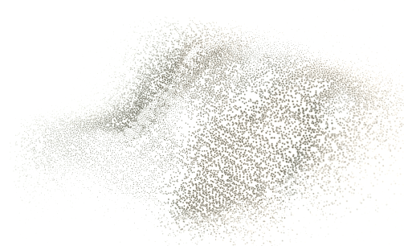

# received-surface



The homepage hero of tomshanks.dev. The image is a visible-band METEOR-M2 4 pass received on 14 September 2026 at 137.9 MHz (LRPT) with a Raspberry Pi 3B and an RTL-SDR Blog V4 on a roof in Denver, decoded with SatDump. At mount the component samples the frame on the GPU into 25,625 points, one per received pixel at this resolution. At rest the points float as a surface that leans toward the pointer; as the page scrolls, `morph` goes from 0 to 1 and every point returns to its pixel, resolving the source frame. Drag moves the cloud before it resolves.

Live: https://tomshanks.dev/

## Files

| File | What |
|---|---|
| `ParticleSurface.tsx` | React client component. Raw WebGL: compiles its own vertex/fragment shaders, builds position/color/seed attributes from the image, and renders on `requestAnimationFrame` while not `paused`. |
| `data/m24-visible-640.webp` | The received frame, downscaled to 640 px wide. 60 KB. No processing beyond SatDump's composite and the downscale. |

## Props

```ts
<ParticleSurface
  morph={0..1}                 // 0 = free particle surface, 1 = resolved image; drive it from scroll
  paused={boolean}             // stop the RAF loop when off-screen
  onReady={(points) => void}   // called once with the point count (25,625 for this frame)
  onFailure={() => void}       // WebGL unavailable; render a still image instead
/>
```

The site wraps it in a hero that computes `morph` from the section's position and fades the original `` in over the canvas as `morph` approaches 1, so the resolved state is the real image, not a point approximation of it.

## Provenance

Pass peak elevation 65°. The same pass produced the Gaussian scene used in the site's Mission Data Workbench; the manifest with per-file SHA-256 is at https://tomshanks.dev/projects/rfpi/gaussian/manifest.json.
